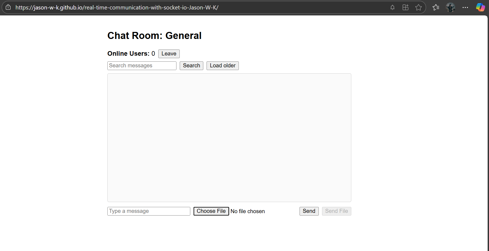

# 💬 Real-Time Chat App with Socket.io

A full-stack real-time chat application built using **React**, **Node.js**, **Express**, and **Socket.io**. It supports global and private messaging, typing indicators, online status, and more — all in real time.

---

## 🔗 Live Frontend

👉 [View the live app](https://jason-w-k.github.io/real-time-communication-with-socket-io-Jason-W-K/)

---

## 🖼️ Chat Interface Preview

---

## 🚀 Features

- 🌍 Global chat room
- ✉️ Private messaging
- 🟢 Online user tracking
- 💬 Typing indicators
- 📷 Image sharing
- ✅ Read receipts
- 🔔 Notifications
- 😄 Message reactions
- 🔍 Search and pagination
- 📱 Mobile responsiveness

---

## 🛠️ Tech Stack

| Frontend | Backend | Real-Time |
|----------|---------|-----------|
| React    | Node.js | Socket.io |
| CSS      | Express |           |
| Vite     | CORS    |           |

---

